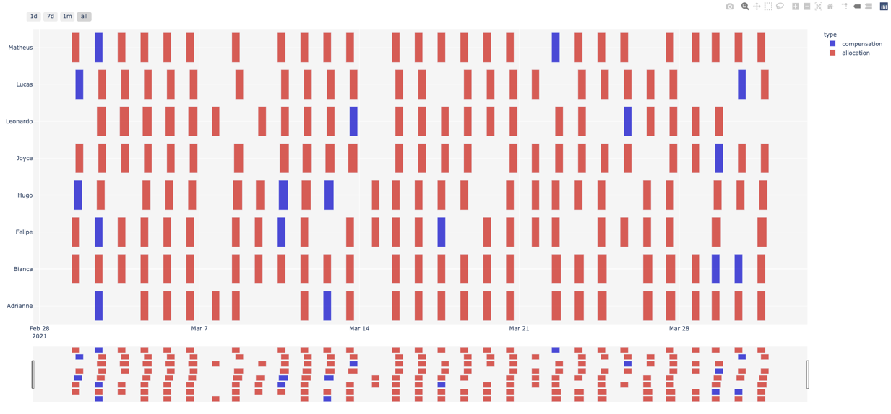

# Otimização de Escalas de Trabalho

Esse modelo foi desenvolvido para otimizar as jornadas de trabalho de 
colaboradores tendo em vista a realidade das leis trabalhistas brasileiras, 
com foco especial na dinâmica de atendimento de lojas do varejo. 
Com base nos dados de entrada e de parâmetros informados pelo usuário do modelo, o 
algoritmo implementado identifica a melhor escala para cada colaborador, 
visando respeitar não somente as restrições legais, mas também preferências 
específicas de cada negócio e as necessidades mínimas de pessoal em cada 
hora e dia do horizonte temporal planejado.

## Objetivos

-	Maximizar o total de dias trabalhados
-	Maximizar o total de horas trabalhadas
-	Maximizar a alocação de pessoal em dias prioritários (ex. final de semana, final do mês)
-	Priorizar as folgas para dias específicos para cada empregado
-	Balancear a quantidade de empregados ao longo dos dias

O modelo de otimização pode ser configurado para atender a múltiplos 
objetivos, que deverão ser cadastrados em ordem de prioridade. O otimizador 
resolverá cada objetivo de forma hierárquica, ou seja, primeiro otimizará o 
primeiro critério, passando em seguida para o segundo e assim sucessivamente.

## Restrições

- Atendimento à demanda mínima de pessoal informada
- Limite máximo de horas semanais trabalhadas
- Número máximo de dias consecutivos trabalhados
- Número máximo de dias da semana consecutivos trabalhados (ex.: número máximo de domingos consecutivos)
- Compensação de feriados trabalhados (cada feriado trabalhado, deverá 
   possuir um dia de folga como compensação)
 
## Dados de Entrada

Os dados de entrada do otimizador são fornecidos através em um arquivo em formato excel (<a href="doc/data_input.xlsx" download="data_input.xlsx">baixe o template de dados aqui</a>), organizado em abas, conforme detalhamento abaixo:

### Location *(Localidade)*
-	**Código da localidade *(texto)*:** identificador único para a localidade 
-	**Cidade *(texto)*:** nome da cidade  
-	**Estado *(texto)*:** código da unidade federativa da cidade cadastrada
-	**País *(texto)*:** país associado à localidade

### Store *(Loja)*
-	**Código da loja *(texto)*:** identificador único da loja
-	**Id da localidade *(texto)*:** código correspondente à localidade informada na 
	 planilha ‘Location’

### Role *(Função)*

-	**Código da Função *(texto)*:** identificador único das possíveis funções 
	 exercidas 
	 pelos colaboradores

### Shift *(Jornada)*

Cada cadastro de jornada, representa um padrão de horários e de dias que o 
colaborador irá seguir ao longo da semana. São informadas as janelas de 
horários permitidos para cada dia em que o colaborador está apto a trabalhar. 
Cada colaborador poderá possuir um ou mais 
padrões de jornada, deixando a cargo do otimizador escolher o padrão ideal 
em cada semana planejada. 

 - **Jornada *(texto)*:** identificador único para a jornada cadastrada. 

 - **Janela de Trabalho 2a/ 3a/ 4a/ 5a/ 6a/ sábado/ domingo *(texto)*:**  
   indicação do início e fim previstos de trabalho, considerando intervalo 
   de descanço/almoço de 1 hora para jornadas acima de 6 horas e não 
   incluindo eventuais horas-extras. Caso não seja desejado que o colaborador 
   trabalhe num determinado dia da semana, o campo deverá ser deixado em 
   branco. O preenchimento, por sua vez, não significa que o colaborador 
   necessariamente trabalhará no dia informado, essa decisão caberá ao 
   modelo matemático a fim de otimizar os resultados desejados.

	 - O cadastro deve obedecer ao padrão “HH:MM – HH:MM” (ex.: 08:30 – 
	   16:30, representando 7 horas de trabalho e 1 hora de descanço entre 
	   8h30 e 16h30).

### Employee *(Colaborador)*
-	**Código do Colaborador *(texto)*:** identificador único do colaborador
-	**Função *(texto)*:** Código da função do colaborador informado na planilha 
     ‘Role’
-	**Loja *(texto)*:** Código da loja correspondente ao colaborador informado na planilha ‘Store’
-	**Duração Jornada Semanal *(número)*:** limite de horas semanais trabalhadas,
     sem considerar horas-extras.
-	**Dias Consecutivos Trabalhados *(inteiro)*:** limite de dias consecutivos trabalhados
-	**Número de Domingos Consecutivos Trabalhados *(inteiro)*:** limite de domingos consecutivos trabalhados
-	**Dia Preferencial para Folga *(texto)*:** dia preferencial para alocar folgas 
     que o colaborador vier a ter direito.
-	**Prazo de Compensação de Feriado Trabalhado (em dias) *(inteiro)*:** prazo 
     limite para compensar feriados trabalhados. Cada feriado gera a necessidade de uma folga em dias úteis de trabalho. 
-	**Licença *(texto)*:** intervalo de dias que o colaborador se encontra 
     indisponível para execício de suas atividades, seja por férias, licença médica, ou qualquer outro motivo. O preenchimento deve obedecer aos formatos: 
        - Único dia: "DD/MM/YYYY"
        - Múltiplos dias: "DD/MM/YYYY, DD/MM/YYYY…"
        - Intervalo de dias: "DD/MM/YYYY - DD/MM/YYYY"
        - Intervalo com tempo: "DD/MM/YYYY HH:MM - DD/MM/YYYY HH:MM"
    

-	**Jornadas *(texto)*:** lista com os identificadores únicos das jornadas possíveis para o colaborador. 
	-	A lista de conter as jornadas separadas por " , " (vírgula)  

### Demand *(Demanda)*
 - **Loja *(texto)*:** código correspondente a uma das lojas informadas na planilha 'Store'
 - **Função *(texto)*:** código correspondente a uma das funções informadas na 
   planilha ‘Role’
 - **Dia *(data ou texto)*:** dia correspondente à demanda. Caso desejemos informar um padrão por dia da semana que se repete ao longo de todo horizonte a ser otimizado, pode-se cadastrar, ao invés do dia, os códigos 'mon', 'tue', 'wed', 'thu', 'fri', 'sat' ou 'sun' representando os dias da semana de segunda-feira a domingo, nessa ordem.
 - **Início *(texto)*:** texto no formato "HH:MM" representando a hora de início 
   da demanda a ser informada
 - **Fim *(texto)*:** texto no formato "HH:MM" representando a hora de término da demanda a ser informada
 - **Quantidade Mínima *(inteiro)*:** quantidade mínima de pessoas da função informada, necessária na loja e janela de tempo informada. 

Caso não seja informada a demanda de um determinado dia, será considerado que não poderá haver colaboradores trabalhando na respectiva data. Já a quantidade mínima igual a zero, significa que a presença daquele tipo de colaborador é opcional. 

### Holiday *(Feriado)*
  

 - **Dia *(data)*:** dia do feriado
 - **Nacional? *(texto)*:** campo para indicar se o feriado é nacional
 - **Regional? *(texto)*:** campo para indicar se o feriado é regional, seja estadual ou municipal. Caso seja estadual, será necessário informar o código da UF, em caso de feriado municipal, necessário informar o código da localidade cadastrado em 'Location'

Em caso de feriados regionais, é necessário cadastrar uma linha para cada 
região que os possuam.

### PreviousAllocation *(Alocações Anteriores)*
  

 - **Código do colaborador *(texto)*:** código correspondente a um dos colaboradores informados na planilha 'Employee'
 - **Dia *(data)*:** dia de trabalho do colaborador
 - **Horas Trabalhadas *(texto)*:** tempo líquido trabalhado pelo colaborador, excluindo tempo de descanso, no formato "HH:MM". Caso o dia tenha sido definido como uma compensação, ou seja, sem ter sido trabalhado, será necessário preencher esse campo com a letra "C". 

## Parâmetros

Para execução do modelo de otimização é necessário que sejam informados alguns parâmetros. Alguns desses são obrigatórios e outros opcionais, de uso mais avançado. Esse parâmetros são informados tanto através da API, quando dos aplicativos disponibilizados para uso, podendo a descrição e formato variarem conforme a interface utilizada.

#### Obrigatórios
-	**start_date *(texto)*:** data de início da otimização, no formato "YYYY-MM-DD"
-   **store_id *(texto)*:** lista de códigos de lojas a serem otimizadas. Caso não seja 
  informado, o modelo otimizará todas as lojas cadastradas no arquivo de 
  entrada de dados. 
-   **role_id *(texto)*:** lista de códigos de funções a serem otimizadas. Caso não seja 
  informado, o modelo otimizará todas as funções cadastradas no arquivo de 
  entrada de dados. 
-   **max_horizon *(inteiro)*:** horizonte em dias, a partir da data de início, que será definido para a otimização.

#### Opcionais
- **first_day_of_week *(texto)*:** definição do dia de referência para contabilizar o 
  início de cada semana. O valor segue o padrão 'mon', 'tue', 'wed', 'thu', 
  'fri', 'sat' ou 'sun' representando os dias da semana de segunda-feira a domingo, nessa ordem.
- **allocation_priority_weekdays *(lista)*:** lista dos dias da semana com prioridade de 
  alocação de pessoal (desde que não gere conflito com algum objetivo informado previamente). Os possíveis valores são  'mon', 'tue', 'wed', 'thu', 'fri', 'sat' e 'sun' representando os dias da semana de segunda-feira a domingo.
- **allocation_priority_interval *(lista <texto>)*:** janela dos dias do mês com maior prioridade de alocação. 
- **max_solution_time *(inteiro)*:** tempo máximo em segundos para o otimizador encontrar o resultado ótimo. Caso o tempo seja atingido sem que o valor ótimo seja alcançado, o otimizador retornará o melhor valor obtido.
- **max_solution_improvement_wait *(inteiro)*:** tempo em segundos que otimizador possuirá para obter uma melhoria do resultado do modelo, caso esse tempo seja alcançado, o modelo retornará o melhor resultado obtido e passará para a fase seguinte da otimização.
- **granularity *(inteiro)*:** intervalo de tempo em minutos em que o horizonte temporal será dividido. Quanto menor a granulariade, mais preciso é o resultado, porém mais complexo o modelo será para ser resolvido. O valor *default* é o valor mínimo de 1 minuto.
- **objective_function *(lista <texto>)*:**  lista em ordem de prioridade dos objetivos a serem buscados pelo otimizador. Possíveis valores são "demand_fulfillment", "holiday_compensation",  "priority_working_days", , "working_days", "preferable_rests", "workforce_balance" e "working_hours"

## Outputs
Ao final da execução o modelo de otimização de escalas gera três arquivos de resultados a saber:

### Tabela de alocações completa

Arquivos no formato csv contendo as seguintes colunas:

- **task *(texto)*:** identificador único da alocação
- **start *(texto)*:** início do dia de trabalho no formato "YYYY-MM-DD HH:MM"
- **finish *(texto)*:** término do dia de trabalho no formato "YYYY-MM-DD HH:MM"
- **resource *(texto)*:** código correspondente a um dos colaboradores 
  informados na planilha 'Employee'
- **store *(texto)*:** código correspondente a uma das lojas informadas na planilha 
'Store'
- **type *(texto)*:** tipo da alocação assumindo um dos seguintes valores:
    - "allocation": alocação normal
    - "compensation": dia de compensação de folga
    - "extra": indicação de necessidade de pessoal na janela informada

### Tabela de alocações reduzida

Arquivos no formato csv contendo as colunas mesmas colunas presentes no planilha de entrada de dados 'PreviousAllocation', esse output deve servir como base para ser informado na otimização de escala do período sucessivo:

- **Código do colaborador *(texto)*:** código correspondente a um dos colaboradores informados na planilha 'Employee'
 - **Dia *(data)*:** dia de trabalho
 - **Horas Trabalhadas *(texto)*:** tempo líquido trabalhado pelo colaborador, excluindo tempo de descanso, no formato "HH:MM". Caso o dia tenha sido definido como uma compensação, ou seja, sem ter sido trabalhado, será necessário preencher esse campo com a letra "C". 

### Gráfico Gantt das alocações 

